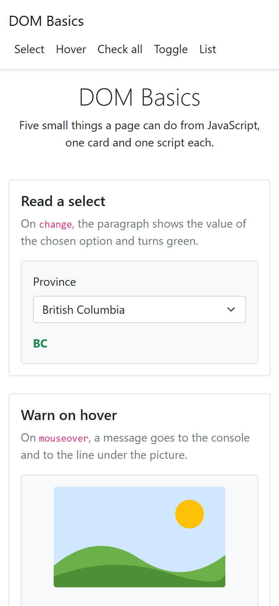

# dom-basics

Five small things a page can do from JavaScript, one card and one script
each: read a select, react to a hover, check every box at once, toggle a
colour, fill a list from an array.

HTML, Bootstrap for the layout, and vanilla JavaScript. No build step, no
JavaScript library: open the file and try each card.

## Screenshots

## How it works

**One script per card, and nothing shared.** Each script grabs the elements
it needs by id and attaches its listener; nothing is written as HTML text.

**`change`, not `click`, for a select.** The province card listens to
`change`, which fires when the chosen option changes, whether by mouse or by
keyboard, and writes the option's `value` into the paragraph with a green
class.

**A hover is `mouseover`, and it clears on `mouseout`.** The warning goes to
the console, as a console message would, and to the line under the picture,
so it is visible without opening the tools.

**Check all looks the boxes up, it does not list them.** The button runs
`querySelectorAll("input[type=checkbox]")` inside the group at click time,
so a box added later, by anyone, is checked too without touching the script.

**Toggling is two classes and one text.** `classList.toggle` returns whether
the red class is now on; that one boolean drives the yellow class and the
button's label, so the three can never disagree.

**Twenty names, twenty `createElement`.** The list is filled from the array
with `for...of`, one item created and appended per name.

## Running it

Open `index.html` in a browser. There is nothing to install.

## Stack

HTML, Bootstrap 5.1 for the layout, and vanilla JavaScript. Five scripts,
one drawn SVG, no stylesheet of its own, no JavaScript library.

## Résumé

Cinq petites choses qu'une page fait en JavaScript, une carte et un script
pour chacune. Une liste déroulante dont la valeur choisie s'affiche en vert
au `change` ; une image qui envoie un avertissement à la console et sous
elle au `mouseover`, effacé au `mouseout` ; un bouton qui coche toutes les
cases du groupe en les cherchant au moment du clic, de sorte qu'une case
ajoutée plus tard est cochée aussi ; une boîte qui bascule entre jaune et
rouge, le bouton annonçant la couleur suivante, les deux classes et le
libellé étant pilotés par un seul booléen ; et vingt noms d'un tableau
devenus vingt éléments de liste, créés un à un. Rien n'est écrit dans la
page à partir de chaînes.

## Licence

MIT. See [LICENSE](LICENSE).
